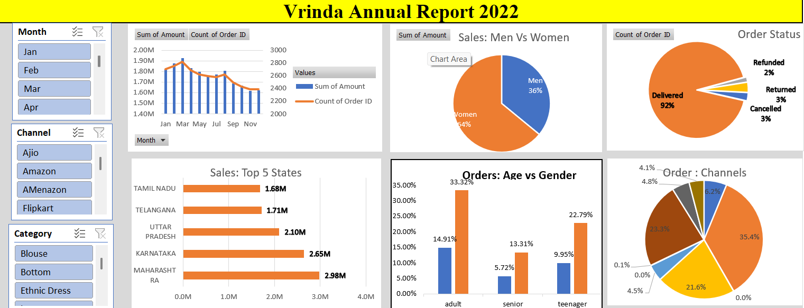

# Vrinda Store Sales Data Analysis Dashboard

## Project Overview
This project focuses on analyzing Vrinda Store’s 2022 sales data and converting raw transactional data into an interactive Excel dashboard with actionable business insights.

The goal was to clean, process, analyze, and visualize the data to answer important business questions regarding sales performance, customer behavior, demographics, geography, and sales channels.

This project demonstrates practical data analytics skills including data cleaning, exploratory data analysis, dashboard creation, business intelligence reporting, and insight generation using Microsoft Excel.

---

## Business Problem
Vrinda Store wanted to better understand customer purchasing behavior and overall sales performance to improve future business decisions and marketing strategies.

The following business questions were addressed:

- Compare sales and orders using a single chart
- Identify the month with the highest sales and orders
- Determine whether men or women purchased more in 2022
- Analyze different order statuses
- List the top 10 states contributing to sales
- Understand the relationship between age and gender based on number of orders
- Identify the highest contributing sales channel
- Determine the best-selling product category

---

## Dataset Information
The dataset contains transactional sales records with the following attributes:

- Order ID
- Customer Gender
- Customer Age
- Order Date
- Sales Amount
- Order Status
- Product Category
- Sales Channel
- State
- Quantity Ordered

---

## Tools Used
- Microsoft Excel
- Pivot Tables
- Pivot Charts
- Slicers
- Data Cleaning Techniques
- Dashboard Design

---

## Project Workflow

### 1. Data Cleaning & Preparation
Performed preprocessing to improve data quality and consistency:

- Removed duplicate records
- Handled missing/null values
- Standardized inconsistent entries
- Formatted date columns
- Created derived columns for analysis
- Validated data consistency

---

### 2. Exploratory Data Analysis
Analyzed the dataset to answer business questions and identify trends:

- Monthly sales trend analysis
- Orders vs sales comparison
- Gender-wise customer purchase analysis
- Age group contribution analysis
- State-wise sales contribution
- Channel performance analysis
- Category performance analysis
- Order status distribution

---

### 3. Dashboard Development
Built an interactive Excel dashboard containing:

- Sales vs Orders comparison chart
- Monthly sales performance analysis
- Gender-wise sales distribution
- Order status breakdown
- Top 10 states contribution chart
- Age vs Gender analysis
- Sales channel comparison
- Product category performance insights

Interactive slicers were included for dynamic filtering and better user interaction.

---

## Key Insights

### Customer Insights
- Women contributed approximately **65% of total purchases**, making them the dominant customer segment.
- Customers in the **30–49 age group contributed nearly 50% of total sales**, making them the most valuable age segment.

### Geographic Insights
Top-performing states:

- Maharashtra
- Karnataka
- Uttar Pradesh

These states contributed approximately **35% of overall sales**.

### Channel Insights
Top-performing sales channels:

- Amazon
- Flipkart
- Myntra

These channels contributed approximately **80% of total sales**.

### Business Insights
- Identified peak sales periods for inventory planning
- Analyzed order fulfillment and cancellation patterns
- Determined top-performing product categories

---

## Final Recommendation
To improve future sales performance, Vrinda Store should focus its marketing efforts on:

**Women customers aged 30–49 living in Maharashtra, Karnataka, and Uttar Pradesh through targeted advertisements, promotional campaigns, coupons, and offers across high-performing sales channels such as Amazon, Flipkart, and Myntra.**

---

## Dashboard Preview
Add your dashboard screenshot here:

---

## Skills Demonstrated
- Data Cleaning
- Data Analysis
- Exploratory Data Analysis (EDA)
- Business Intelligence Reporting
- Dashboard Design
- Excel Data Visualization
- KPI Analysis
- Business Insight Generation

---

## Repository Structure

Vrinda-Store-Sales-Analysis/
│
├── Raw_Data.xlsx
├── Vrinda_Store_Dashboard.xlsx
├── dashboard.png
└── README.md

---

## Project Outcome
This project demonstrates an end-to-end analytics workflow by transforming raw business data into meaningful insights and actionable recommendations, simulating a real-world business analyst use case.
